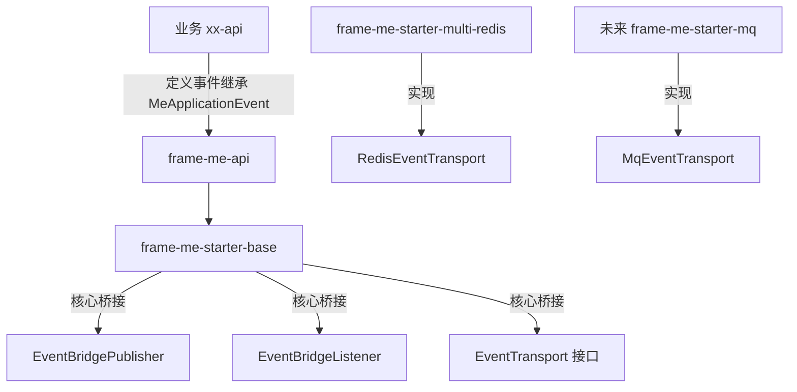
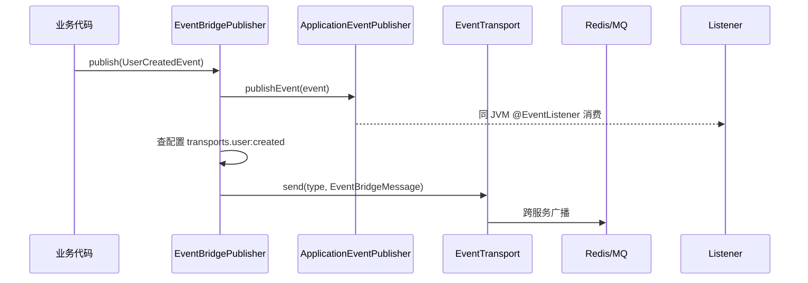
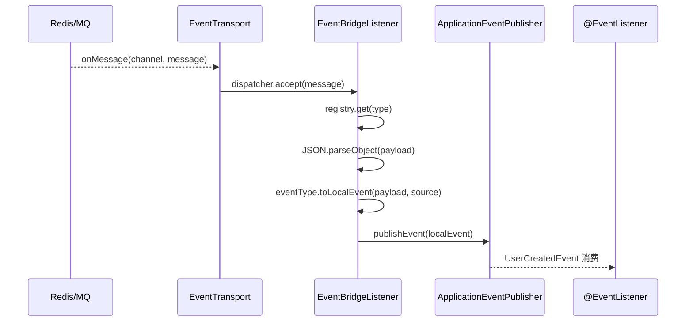
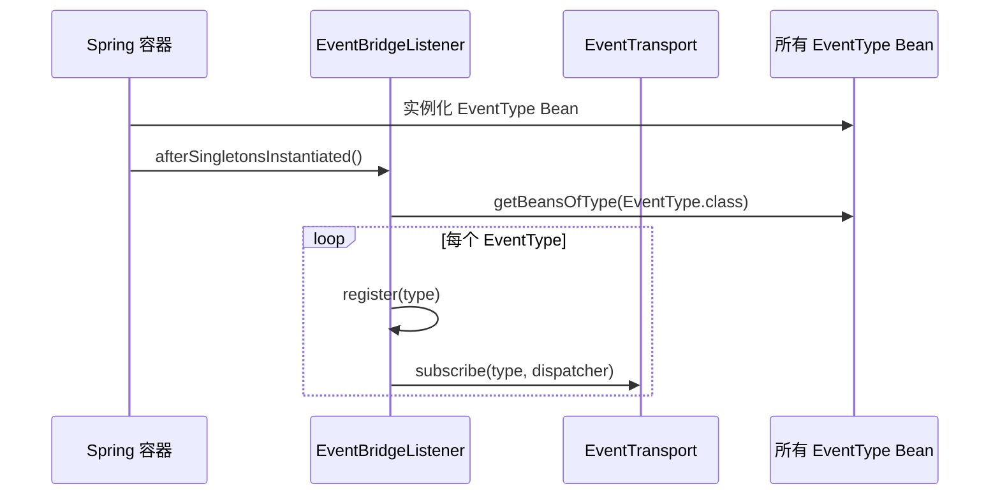
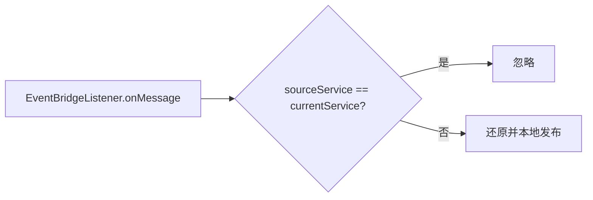
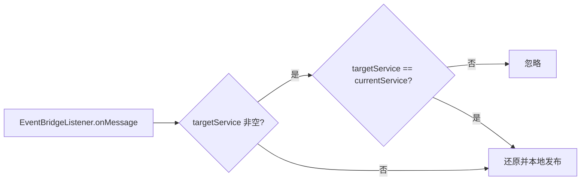

# 事件桥接（Event Bridge）

本文档说明 `frame-me-parent` 的事件桥接机制：如何在进程内使用 Spring `ApplicationEvent` 解耦，又如何通过可插拔的 transport（Redis / MQ）实现跨服务事件通信。

## 目录

- [为什么需要事件桥接](#为什么需要事件桥接)
- [核心概念](#核心概念)
- [模块划分](#模块划分)
- [调用关系图](#调用关系图)
- [使用示例](#使用示例)
- [配置说明](#配置说明)
- [扩展 MQ Transport](#扩展-mq-transport)
- [测试](#测试)

## 为什么需要事件桥接

在微服务场景中，经常遇到两类需求：

1. **进程内解耦**：一个业务动作完成后，需要触发多个本地处理逻辑（如发通知、更新索引、记日志）。
2. **跨服务通信**：同一事件需要被其他服务实例感知。

Spring `ApplicationEvent` 只能解决第一类；Redis Pub/Sub、MQ 能解决第二类，但会把事件模型和传输细节耦合到业务代码里。事件桥接把两者统一：业务始终面向 `ApplicationEvent` 编程，传输通道可配置、可切换。

## 核心概念

| 类型 | 职责 | 所在模块 |
|---|---|---|
| `MeApplicationEvent` | 可桥接的本地事件基类 | `frame-me-api` |
| `EventType<T>` | 把 `type` 字符串映射到负载类与本地事件构造 | `frame-me-api` |
| `EventBridgeMessage` | 跨服务传输的通用包装：`type + payload + sourceService + targetService + targetId + timestamp` | `frame-me-api` |
| `EventTransport` | 传输通道抽象（`send` / `subscribe`） | `frame-me-starter-base` |
| `EventBridgePublisher` | 发布入口：本地发布 + 选择 transport 广播 | `frame-me-starter-base` |
| `EventBridgeListener` | 订阅通道、按 `type` 分发、还原为本地事件 | `frame-me-starter-base` |
| `EventBridgeProperties` | `me.event-bridge.*` 配置 | `frame-me-starter-base` |
| `RedisEventTransport` | Redis Pub/Sub 实现 | `frame-me-starter-multi-redis` |

## 模块划分



- `frame-me-api`：只放事件契约，让业务 `xx-api` 模块能定义事件。
- `frame-me-starter-base`：放桥接核心，不依赖 Redis/MQ。
- `frame-me-starter-multi-redis` / `frame-me-starter-mq`：只放具体 transport 实现。

## 调用关系图

### 发布事件



### 接收事件



### 启动时自动注册



### 自身消息过滤

Redis Pub/Sub 会把消息广播给所有订阅者，包括发布者自己。`EventBridgeListener` 会对比 `message.sourceService` 与当前 `me.event-bridge.service-name`：若相同则忽略，避免同服务实例重复消费。



### 点对点路由

事件默认按 `eventType` 广播给所有订阅该类型的服务。若只想发给特定服务或特定实体，可在事件中覆盖 `getTargetService()` / `getTargetId()`：

```java
@Getter
public class UserNotifyEvent extends MeApplicationEvent {

    private final UserNotifyPayload payload;
    private final String targetService;
    private final String targetId;

    public UserNotifyEvent(Object source, UserNotifyPayload payload,
                           String targetService, String targetId) {
        super(payload);
        this.payload = payload;
        this.targetService = targetService;
        this.targetId = targetId;
    }

    @Override
    public String getEventType() {
        return "user:notify";
    }

    @Override
    public String getTargetService() {
        return targetService;
    }

    @Override
    public String getTargetId() {
        return targetId;
    }
}
```

- `targetService`：指定哪个服务消费，其他服务收到后直接忽略。
- `targetId`：目标服务内部可据此进一步路由到具体用户 / 实例 / 会话。



> `targetService` 由 `EventBridgeListener` 过滤；`targetId` 由 `frame-me-starter-sse-mvc` 的 `SseEventDispatcher` 和 `frame-me-starter-ws-mvc` 的 `WsMvcEventDispatcher` 自动识别：若事件携带 `targetId`，则调用定向推送 `pushToReceiver(targetId, ...)`，否则仍按 `eventType` 广播。

### SSE / WebSocket 广播控制

`SseEventDispatcher` 与 `WsMvcEventDispatcher` 默认监听所有 `MeApplicationEvent` 子类。为避免内部事件意外暴露到前端，只有标注了 `@EventClientPermit` 的事件类才会被转发：

```java
import com.frame.me.event.EventClientPermit;

@EventClientPermit
@Getter
public class UserNotifyEvent extends MeApplicationEvent {
    ...
}
```

未标注 `@EventClientPermit` 的事件（如审计日志 `AuditLogEvent`）不会通过 SSE / WebSocket 推送给客户端。

## 使用示例

### 1. 定义事件与负载

在 `xx-api` 模块中：

```java
@Data
@NoArgsConstructor
@AllArgsConstructor
public class UserCreatedPayload implements Serializable {
    private Long userId;
    private String username;
}
```

```java
@Getter
public class UserCreatedEvent extends MeApplicationEvent {

    private final Object source;
    private final UserCreatedPayload payload;

    public UserCreatedEvent(Object source, UserCreatedPayload payload) {
        super(payload);
        this.source = source;
        this.payload = payload;
    }

    @Override
    public String getEventType() {
        return "user:created";
    }
}
```

### 2. 注册事件类型

在 `xx-api` 模块中声明 `EventType`，并通过配置类暴露：

```java
public class UserCreatedEventType implements EventType<UserCreatedPayload> {

    @Override
    public String type() {
        return "user:created";
    }

    @Override
    public Class<UserCreatedPayload> payloadClass() {
        return UserCreatedPayload.class;
    }

    @Override
    public MeApplicationEvent toLocalEvent(UserCreatedPayload payload, String source) {
        return new UserCreatedEvent(source, payload);
    }
}
```

```java
@Configuration(proxyBeanMethods = false)
public class UserCreatedEventConfiguration {

    @Bean
    public UserCreatedEventType userCreatedEventType() {
        return new UserCreatedEventType();
    }
}
```

发布方和订阅方在各自的 `xx-service` 中通过 `@Import` 引入该配置：

```java
@Import(UserCreatedEventConfiguration.class)
@SpringBootApplication
public class UserServiceApplication {
}
```

`EventBridgeListener` 会在启动时自动收集并注册所有 `EventType` Bean。

> 为什么不用 `@Component`？因为 `xx-api` 会被不同服务引用，各服务的 Spring 组件扫描根包可能不一致，`@Component` 可能扫不到。显式 `@Import` 可以让消费方明确引入事件契约，避免事件类型遗漏注册。

### 3. 发布事件

```java
@Service
@RequiredArgsConstructor
public class UserService {

    private final EventBridgePublisher publisher;

    public void createUser(String username) {
        Long userId = ...;
        UserCreatedPayload payload = new UserCreatedPayload(userId, username);
        publisher.publish(new UserCreatedEvent(this, payload));
    }
}
```

### 4. 消费事件

```java
@Component
@Slf4j
public class UserCreatedEventHandler {

    @EventListener
    public void onUserCreated(UserCreatedEvent event) {
        log.info("User created: {}", event.getPayload().getUsername());
    }
}
```

## 配置说明

```yaml
me:
  event-bridge:
    enabled: true                       # 默认 true
    # service-name 未配置时，自动取 spring.application.name；
    # 若 spring.application.name 也未配置，则回退为 "unknown"。
    service-name:                       # 默认 spring.application.name
    topic-prefix: "me:event:"           # Redis Topic 前缀
    default-transport: redis            # 未配置 type 时的默认通道
    transports:
      user:created: redis
      order:paid: mq                    # 未来接入 MQ 后生效
```

| 配置项 | 说明 |
|---|---|
| `enabled` | 是否启用事件桥接 |
| `service-name` | 当前服务名，用于追踪来源与自身消息过滤；未配置时默认取 `spring.application.name`，再未配置时回退为 `unknown` |
| `topic-prefix` | Redis Topic 前缀 |
| `default-transport` | 默认 transport 名称，对应 Bean 名或去掉 `EventTransport` 后缀的名称 |
| `transports.{type}` | 按事件类型指定 transport |

## 扩展 MQ Transport

1. 新建 Maven 模块 `frame-me-starter-mq`，引入对应 MQ starter。
2. 实现 `EventTransport`：

```java
public class MqEventTransport implements EventTransport {
    @Override
    public void send(String type, EventBridgeMessage message) { ... }

    @Override
    public void subscribe(String type, Consumer<EventBridgeMessage> dispatcher) { ... }
}
```

3. 注册 Bean，名称需为 `mqEventTransport`（或 `mq`）：

```java
@Bean
public MqEventTransport mqEventTransport() {
    return new MqEventTransport();
}
```

4. 业务配置：

```yaml
me:
  event-bridge:
    transports:
      order:paid: mq
```

核心层代码无需改动。

## 测试

- 单元测试：`frame-me-starter-base/src/test/java/com/frame/me/base/event/EventBridgePublisherTest.java`
- Redis transport 单元测试：`frame-me-starter-multi-redis/src/test/java/com/frame/me/redis/event/RedisEventTransportTest.java`
- 端到端测试：`frame-me-tester/frame-me-tester-service/src/test/java/com/frame/me/tester/event/UserCreatedEventFlowTest.java`

运行：

```bash
export JAVA_HOME=/Library/Java/JavaVirtualMachines/zulu-25.jdk/Contents/Home
mvn test -pl frame-me-api,frame-me-starter-base,frame-me-starter-multi-redis,frame-me-tester/frame-me-tester-service -am
```

## 关键文件索引

- 契约：`frame-me-api/src/main/java/com/frame/me/event/`
- 核心：`frame-me-starter-base/src/main/java/com/frame/me/base/event/`
- Redis 实现：`frame-me-starter-multi-redis/src/main/java/com/frame/me/redis/event/RedisEventTransport.java`
- Redis 自动配置：`frame-me-starter-multi-redis/src/main/java/com/frame/me/redis/config/RedisEventTransportAutoConfiguration.java`
- 示例：`frame-me-tester/frame-me-tester-service/src/test/java/com/frame/me/tester/event/`
