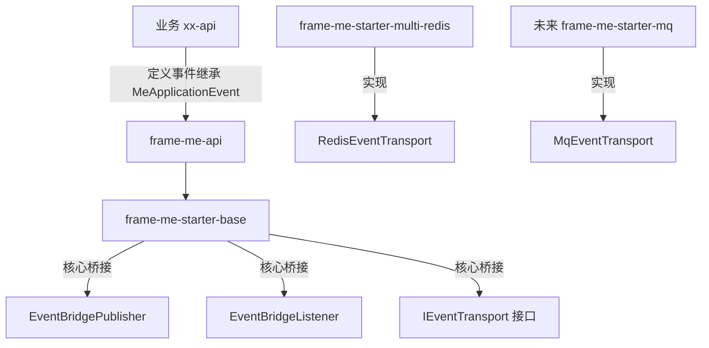
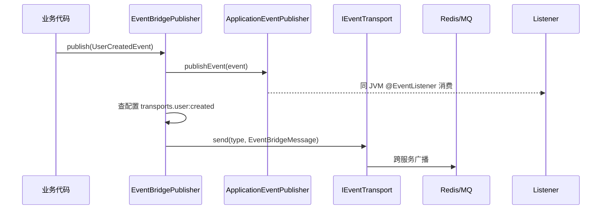
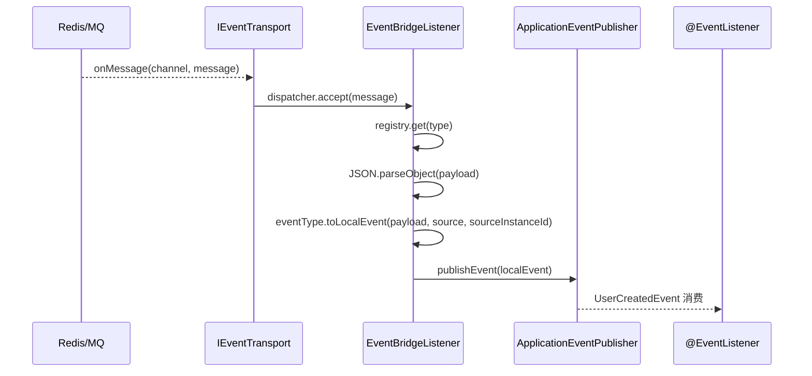
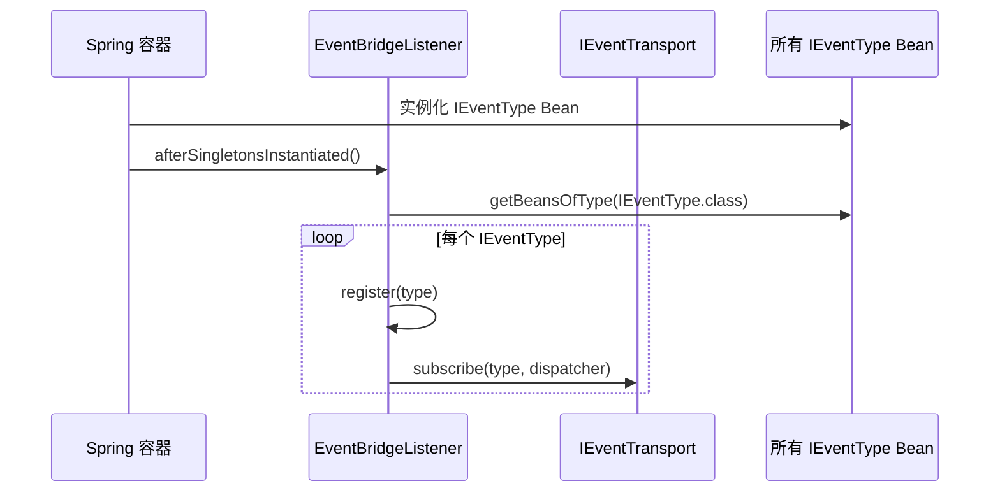
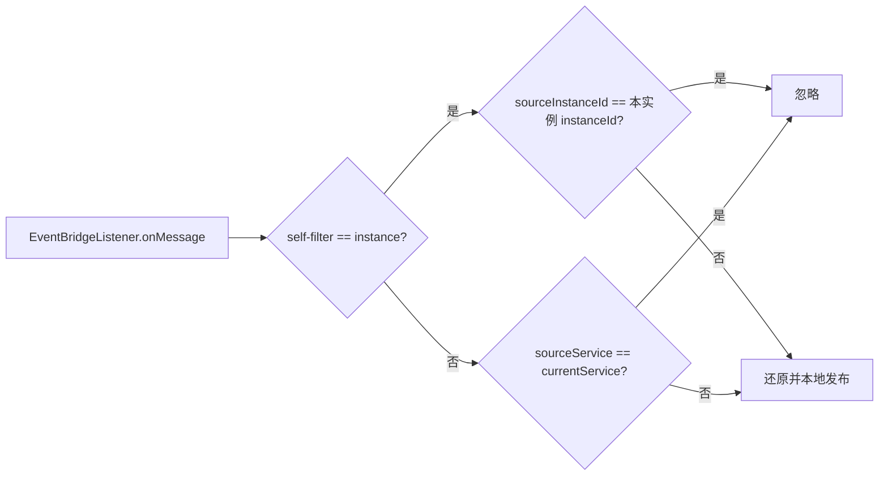
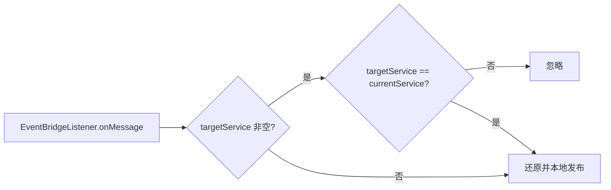

# 事件桥接（Event Bridge）

本文档说明 `frame-me-parent` 的事件桥接机制：如何在进程内使用 Spring 事件机制解耦，又如何通过可插拔的 transport（Redis / MQ）实现跨服务事件通信。

## 目录

- [为什么需要事件桥接](#为什么需要事件桥接)
- [核心概念](#核心概念)
- [模块划分](#模块划分)
- [调用关系图](#调用关系图)
- [使用示例](#使用示例)
- [配置说明](#配置说明)
- [扩展 MQ Transport](#扩展-mq-transport)
- [测试](#测试)

## 为什么需要事件桥接

在微服务场景中，经常遇到两类需求：

1. **进程内解耦**：一个业务动作完成后，需要触发多个本地处理逻辑（如发通知、更新索引、记日志）。
2. **跨服务通信**：同一事件需要被其他服务实例感知。

Spring 事件机制只能解决第一类；Redis Pub/Sub、MQ 能解决第二类，但会把事件模型和传输细节耦合到业务代码里。事件桥接把两者统一：业务始终面向 `MeApplicationEvent` 编程，传输通道可配置、可切换。

## 核心概念

| 类型 | 职责 | 所在模块 |
|---|---|---|
| `MeApplicationEvent` | 可桥接的本地事件基类（含 `eventId` 唯一 ID，缺省 UUID，可自定义） | `frame-me-api` |
| `IEventType<T>` | 把 `type` 字符串映射到负载类与本地事件构造 | `frame-me-api` |
| `EventBridgeMessage` | 跨服务传输的通用包装：`type + payload + sourceService + sourceInstanceId + targetService + targetId + eventId + timestamp` | `frame-me-api` |
| `IEventTransport` | 传输通道抽象（`send` / `subscribe`） | `frame-me-starter-base` |
| `EventBridgePublisher` | 发布入口：本地发布 + 选择 transport 广播 | `frame-me-starter-base` |
| `EventBridgeListener` | 订阅通道、按 `type` 分发、还原为本地事件 | `frame-me-starter-base` |
| `EventBridgeProperties` | `me.event-bridge.*` 配置 | `frame-me-starter-base` |
| `RedisEventTransport` | Redis Pub/Sub 实现 | `frame-me-starter-multi-redis` |

> 说明：`MeApplicationEvent` 是普通 POJO，不继承 Spring 的 `ApplicationEvent`。`EventBridgePublisher` 通过 `ApplicationEventPublisher.publishEvent(Object)` 发布，Spring 会将其包装为 `PayloadApplicationEvent`；`@EventListener` 方法仍按参数类型正常接收。

## 模块划分


```mermaid
graph TD
    A[业务 xx-api] -->|定义事件继承 MeApplicationEvent| B[frame-me-api]
    B --> C[frame-me-starter-base]
    C -->|核心桥接| D[EventBridgePublisher]
    C -->|核心桥接| E[EventBridgeListener]
    C -->|核心桥接| F[IEventTransport 接口]
    G[frame-me-starter-multi-redis] -->|实现| H[RedisEventTransport]
    I[未来 frame-me-starter-mq] -->|实现| J[MqEventTransport]
```

- `frame-me-api`：只放事件契约，让业务 `xx-api` 模块能定义事件。
- `frame-me-starter-base`：放桥接核心，不依赖 Redis/MQ。
- `frame-me-starter-multi-redis` / `frame-me-starter-mq`：只放具体 transport 实现。
- `RedisEventTransport` 装配条件：classpath 存在 Redisson、容器中**同时**存在 `RedissonClient` 与 `EventBridgeProperties` bean、`me.event-bridge.enabled=true`。依赖 `RedissonClient` bean（而非仅 classpath）是为了保证 `RedissonAutoConfiguration` 已完成 `RedissonTopic` 静态初始化——`me.redis.enabled=false` 时 transport 不装配，`EventBridgePublisher` / `EventBridgeListener` 对缺失 transport 走 WARN 降级。装配顺序由 `@AutoConfigureAfter` 显式声明，不依赖类名字典序。

## 调用关系图

### 发布事件


```mermaid
sequenceDiagram
    participant Biz as 业务代码
    participant Pub as EventBridgePublisher
    participant Local as ApplicationEventPublisher
    participant Transport as IEventTransport
    participant Channel as Redis/MQ

    Biz->>Pub: publish(UserCreatedEvent)
    Pub->>Local: publishEvent(event)
    Local-->>Listener: 同 JVM @EventListener 消费
    Pub->>Pub: 查配置 transports.user:created
    Pub->>Transport: send(type, EventBridgeMessage)
    Transport->>Channel: 跨服务广播
```

### 接收事件


```mermaid
sequenceDiagram
    participant Channel as Redis/MQ
    participant Transport as IEventTransport
    participant Listener as EventBridgeListener
    participant Local as ApplicationEventPublisher
    participant Handler as @EventListener

    Channel-->>Transport: onMessage(channel, message)
    Transport->>Listener: dispatcher.accept(message)
    Listener->>Listener: registry.get(type)
    Listener->>Listener: JSON.parseObject(payload)
    Listener->>Listener: eventType.toLocalEvent(payload, source, sourceInstanceId)
    Listener->>Local: publishEvent(localEvent)
    Local-->>Handler: UserCreatedEvent 消费
```

### 启动时自动注册


```mermaid
sequenceDiagram
    participant Spring as Spring 容器
    participant Listener as EventBridgeListener
    participant Transport as IEventTransport
    participant Types as 所有 IEventType Bean

    Spring->>Types: 实例化 IEventType Bean
    Spring->>Listener: afterSingletonsInstantiated()
    Listener->>Types: getBeansOfType(IEventType.class)
    loop 每个 IEventType
        Listener->>Listener: register(type)
        Listener->>Transport: subscribe(type, dispatcher)
    end
```

### 自身消息过滤

Redis Pub/Sub 会把消息广播给所有订阅者，包括发布者自己。`EventBridgeListener` 按 `me.event-bridge.self-filter` 二选一过滤"自产"回声：

- **`instance`（默认）**：比较 `message.sourceInstanceId` 与本实例 `me.event-bridge.instance-id`，仅丢弃本 JVM 发出的回声；**同服务名的其他实例消息放行**——多实例部署（如 SSO 实例 A 踢人广播）可以互通。
- **`service`**（旧语义）：比较 `sourceService` 与 `service-name`，同服务名的消息全部丢弃（同服务多实例互收不到）。

> `instance-id` 未配置时启动期自动兜底：`<HOSTNAME>:<server.port>`（HOSTNAME 环境变量优先，k8s 中为 Pod 名；缺失走 InetAddress）→ 启动随机 UUID（warn 提示）。`server.port=0`（随机端口）时读到的是字面值，同机多实例会撞成相同 `host:0` 互吞消息，故该场景也降级 UUID。显式配置 `instance-id` 必须保证实例唯一，多实例配相同值会互吞消息。
>
> `service-name` 仍用于事件追踪、service 模式自过滤与点对点路由：未配置时取 `spring.application.name`，再未配置时生成 `unknown-<uuid>`（warn 提示）。


```mermaid
graph LR
    A[EventBridgeListener.onMessage] --> B{self-filter == instance?}
    B -->|是| C{sourceInstanceId == 本实例 instanceId?}
    B -->|否| D{sourceService == currentService?}
    C -->|是| E[忽略]
    C -->|否| F[还原并本地发布]
    D -->|是| E
    D -->|否| F
```

### 事件唯一 ID 与消费方幂等

`MeApplicationEvent` 基类带 `eventId` 字段：

- **发送时**缺省生成 UUID，业务可在构造后 `setEventId` 覆盖自定义值（如业务流水号、雪花 ID）
- **广播时** `EventBridgePublisher` 把 `eventId` 透传进 `EventBridgeMessage`
- **接收方** `EventBridgeListener` 重建本地事件后回填 `eventId`，消费方从 `event.getEventId()` 拿

使用方自行决定是否用于去重/幂等。跨服务事件"至少一次"语义下同一事件可能重复投递，消费方可按 `eventId` 加分布式锁或唯一索引保证幂等。

> 示例：`frame-me-audit-service` 的 `LogEventListener` 以 `audit:log:dedup:<eventId>` 为 key 加 Redis 分布式锁，保证多实例部署时同一审计事件全局只入库一次。**锁不主动释放**，靠 TTL（30s）自动过期——覆盖 pub/sub "至少一次"语义下的重投递窗口（先后来到，非并发）；锁失败降级放行（遵"审计是旁路"原则，宁可重复不可丢失）。

### 点对点路由

事件默认按 `eventType` 广播给所有订阅该类型的服务。若只想发给特定服务或特定实体，可在事件中覆盖 `getTargetService()` / `getTargetId()`：

```java
@Getter
public class UserNotifyEvent extends MeApplicationEvent {

    private final UserNotifyPayload payload;
    private final String targetService;
    private final String targetId;

    public UserNotifyEvent(Object source, UserNotifyPayload payload,
                           String targetService, String targetId) {
        super(source);
        this.payload = payload;
        this.targetService = targetService;
        this.targetId = targetId;
    }

    @Override
    public String getEventType() {
        return "user:notify";
    }

    @Override
    public Object getPayload() {
        return payload;
    }

    @Override
    public String getTargetService() {
        return targetService;
    }

    @Override
    public String getTargetId() {
        return targetId;
    }
}
```

- `targetService`：指定哪个服务消费，其他服务收到后直接忽略。
- `targetId`：目标服务内部可据此进一步路由到具体用户 / 实例 / 会话。


```mermaid
graph LR
    A[EventBridgeListener.onMessage] --> B{targetService 非空?}
    B -->|是| C{targetService == currentService?}
    C -->|否| D[忽略]
    C -->|是| E[还原并本地发布]
    B -->|否| E
```

> `targetService` 由 `EventBridgeListener` 过滤；`targetId` 由 `frame-me-starter-sse-mvc` 的 `SseEventDispatcher` 和 `frame-me-starter-ws-mvc` 的 `WsMvcEventDispatcher` 自动识别：若事件携带 `targetId`，则调用定向推送 `pushToReceiver(targetId, ...)`，否则仍按 `eventType` 广播。

### SSE / WebSocket 广播控制

`SseEventDispatcher` 与 `WsMvcEventDispatcher` 默认监听所有 `MeApplicationEvent` 子类。为避免内部事件意外暴露到前端，只有标注了 `@EventClientPermit` 的事件类才会被转发：

```java
import com.frame.me.event.EventClientPermit;

@EventClientPermit
@Getter
public class UserNotifyEvent extends MeApplicationEvent {
    ...
}
```

未标注 `@EventClientPermit` 的事件（如审计日志 `AuditLogEvent`）不会通过 SSE / WebSocket 推送给客户端。

## 使用示例

### 1. 定义事件与负载

在 `xx-api` 模块中：

```java
@Data
@NoArgsConstructor
@AllArgsConstructor
public class UserCreatedPayload implements Serializable {
    private Long userId;
    private String username;
}
```

```java
@Getter
public class UserCreatedEvent extends MeApplicationEvent {

    private final UserCreatedPayload payload;

    public UserCreatedEvent(Object source, UserCreatedPayload payload) {
        super(source);
        this.payload = payload;
    }

    @Override
    public String getEventType() {
        return "user:created";
    }

    @Override
    public Object getPayload() {
        return payload;
    }
}
```

### 2. 注册事件类型

在 `xx-api` 模块中声明 `IEventType`，并通过配置类暴露：

```java
public class UserCreatedEventType implements IEventType<UserCreatedPayload> {

    @Override
    public String type() {
        return "user:created";
    }

    @Override
    public Class<UserCreatedPayload> payloadClass() {
        return UserCreatedPayload.class;
    }

    @Override
    public MeApplicationEvent toLocalEvent(UserCreatedPayload payload, String source, String sourceInstanceId) {
        return new UserCreatedEvent(source, payload);
    }
}
```

```java
@Configuration(proxyBeanMethods = false)
public class UserCreatedEventConfiguration {

    @Bean
    public UserCreatedEventType userCreatedEventType() {
        return new UserCreatedEventType();
    }
}
```

发布方和订阅方在各自的 `xx-service` 中通过 `@Import` 引入该配置：

```java
@Import(UserCreatedEventConfiguration.class)
@SpringBootApplication
public class UserServiceApplication {
}
```

`EventBridgeListener` 会在启动时自动收集并注册所有 `IEventType` Bean。

> 为什么不用 `@Component`？因为 `xx-api` 会被不同服务引用，各服务的 Spring 组件扫描根包可能不一致，`@Component` 可能扫不到。显式 `@Import` 可以让消费方明确引入事件契约，避免事件类型遗漏注册。

### 3. 发布事件

```java
@Service
@RequiredArgsConstructor
public class UserService {

    private final EventBridgePublisher publisher;

    public void createUser(String username) {
        Long userId = ...;
        UserCreatedPayload payload = new UserCreatedPayload(userId, username);
        publisher.publish(new UserCreatedEvent(this, payload));
    }
}
```

### 4. 消费事件

```java
@Component
@Slf4j
public class UserCreatedEventHandler {

    @EventListener
    public void onUserCreated(UserCreatedEvent event) {
        log.info("User created: {}", event.getPayload().getUsername());
    }
}
```

## 配置说明

```yaml
me:
  event-bridge:
    enabled: true                       # 默认 true
    # service-name 未配置时，自动取 spring.application.name；
    # 若 spring.application.name 也未配置，则生成 unknown-<uuid> 实例唯一名（warn 提示），
    # 保证自过滤可用。
    service-name:                       # 默认 spring.application.name
    # instance-id 未配置时，回退 <HOSTNAME>:<server.port>，再不可用则启动随机 UUID（warn 提示）；
    # 显式配置必须实例唯一，多实例配相同值会互吞消息。
    instance-id:                        # 默认 host:server.port
    self-filter: instance               # 自身消息过滤模式：instance（默认，只丢本 JVM 回声）/ service（旧语义，同服务名全丢）
    topic-prefix: "me:event:"           # Redis Topic 前缀
    default-transport: redis            # 未配置 type 时的默认通道
    transports:
      user:created: redis
      order:paid: mq                    # 未来接入 MQ 后生效
```

| 配置项 | 说明 |
|---|---|
| `enabled` | 是否启用事件桥接 |
| `service-name` | 当前服务名，用于追踪来源、service 模式自过滤与点对点路由；未配置时默认取 `spring.application.name`，再未配置时生成 `unknown-<uuid>` 实例唯一名（warn 提示） |
| `instance-id` | 当前实例标识（JVM 进程级），用于 instance 模式自过滤；未配置时回退 `<HOSTNAME>:<server.port>`，再不可用（含 `server.port=0`）时生成启动随机 UUID（warn 提示）；显式配置必须实例唯一 |
| `self-filter` | 自身消息过滤模式：`instance`（默认，仅丢本 JVM 回声，同服务多实例互通）/ `service`（旧语义，同服务名全丢） |
| `topic-prefix` | Redis Topic 前缀 |
| `default-transport` | 默认 transport 名称，对应 Bean 名或去掉 `IEventTransport` 后缀的名称 |
| `transports.{type}` | 按事件类型指定 transport |

## 扩展 MQ Transport

1. 新建 Maven 模块 `frame-me-starter-mq`，引入对应 MQ starter。
2. 实现 `IEventTransport`：

```java
public class MqEventTransport implements IEventTransport {
    @Override
    public void send(String type, EventBridgeMessage message) { ... }

    @Override
    public void subscribe(String type, Consumer<EventBridgeMessage> dispatcher) { ... }
}
```

3. 注册 Bean，名称需为 `mqEventTransport`（或 `mq`）：

```java
@Bean
public MqEventTransport mqEventTransport() {
    return new MqEventTransport();
}
```

4. 业务配置：

```yaml
me:
  event-bridge:
    transports:
      order:paid: mq
```

核心层代码无需改动。

## 测试

- 单元测试：`frame-me-starter-base/src/test/java/com/frame/me/base/event/EventBridgePublisherTest.java`
- Redis transport 单元测试：`frame-me-starter-multi-redis/src/test/java/com/frame/me/redis/event/RedisEventTransportTest.java`
- 端到端测试：`frame-me-tester/frame-me-tester-service/src/test/java/com/frame/me/tester/event/UserCreatedEventFlowTest.java`

运行：

```bash
export JAVA_HOME=/Library/Java/JavaVirtualMachines/zulu-21.jdk/Contents/Home
mvn test -pl frame-me-api,frame-me-starter-base,frame-me-starter-multi-redis,frame-me-tester/frame-me-tester-service -am
```

## 关键文件索引

- 契约：`frame-me-api/src/main/java/com/frame/me/event/`
- 核心：`frame-me-starter-base/src/main/java/com/frame/me/base/event/`
- Redis 实现：`frame-me-starter-multi-redis/src/main/java/com/frame/me/redis/event/RedisEventTransport.java`
- Redis 自动配置：`frame-me-starter-multi-redis/src/main/java/com/frame/me/redis/config/RedisEventTransportAutoConfiguration.java`
- 示例：`frame-me-tester/frame-me-tester-service/src/test/java/com/frame/me/tester/event/`
